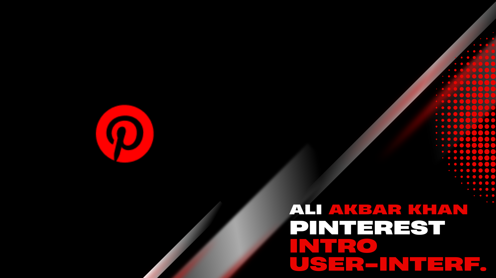

# Pinterest Intro Animation Prototype 

## All Rights Reserved.
This repository and its contents are copyrighted. No part of this repository may be reproduced, distributed, or used without explicit permission from the owner.

## Overview 
This repository contains the Figma prototype for a **Pinterest Intro Animation**. The animation is designed to create a visually stunning and smooth experience for users as they interact with the platform. It sets the tone for Pinterest’s sleek and stylish interface while engaging users from the moment they open the app.

## Features 
- **Seamless Animation**: Smooth transitions and visually captivating motion to grab attention.
- **On-Brand Design**: Reflects Pinterest's signature look and feel, blending minimalist and modern elements.
- **Mobile and Desktop Friendly**: Optimized for all screen sizes to ensure consistent performance across devices.

## Prototype Preview 
You can view the prototype on Figma using [this link](https://www.figma.com/community/file/1334529514939717864/pintrests).

## Videos 

https://github.com/user-attachments/assets/515957b1-1829-4e8a-88ad-094ab4f8335b

## Files in the Repository 
- **Prototype Files** (`.fig`): Figma project file showcasing the Pinterest intro animation.
- **Screenshots** (`.png`, `.jpg`): Visual snapshots of different stages of the animation.
- **Video Demos** (`.mp4`, `.gif`): Clips demonstrating the smooth transitions and final animation output.
- **Documentation** (`.pdf`): Explanation of the animation flow, timing, and design elements.

## How to Use 
1. Download the `.fig` file or access the Figma prototype via the link provided.
2. Use Figma to explore and edit the animation on both desktop and mobile devices.

## Future Plans 
- Experiment with adding sound or interactive elements to further enhance the intro.
- Gather user feedback to fine-tune the animation for a better experience.

## License 

https://github.com/user-attachments/assets/1b6f530c-0eb8-4c25-90c6-f26a9c64263a

## Contributing 
This project is not open for contributions at the moment, but feedback and suggestions are always appreciated!

